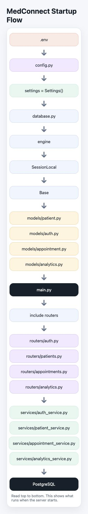
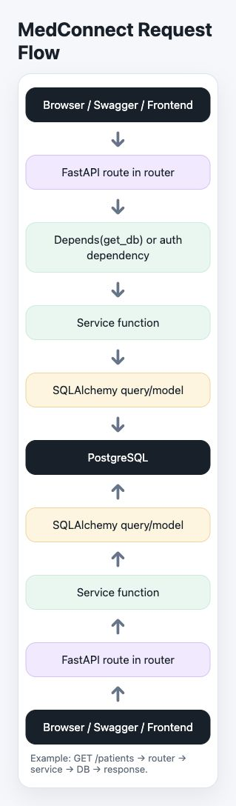
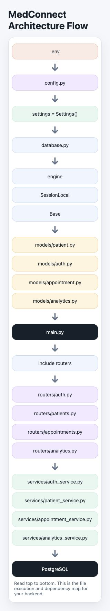

# MedConnect Flow Charts

This page explains the three architecture diagrams used in MedConnect documentation.

## 1. Startup Flow

This chart shows what happens when the backend starts:

1. `.env` stores environment values.
2. `config.py` reads those values into `settings = Settings()`.
3. `database.py` uses the settings to create `engine`, `SessionLocal`, and `Base`.
4. `models/*.py` defines tables using `Base`.
5. `main.py` creates the FastAPI app and includes routers.
6. `routers/*.py` expose API endpoints.
7. `services/*.py` contain the business logic.
8. PostgreSQL stores the actual data.

## 2. Request Flow

This chart shows what happens when a user hits an API endpoint:

1. The browser, Swagger UI, or frontend sends a request.
2. FastAPI receives it in the correct router.
3. Dependencies like `Depends(get_db)` provide a database session or auth context.
4. The router calls the service layer.
5. The service uses SQLAlchemy to query or update the database.
6. PostgreSQL returns the data.
7. The response goes back through the router to the client.

Example: `GET /patients` -> router -> service -> database -> response.

## 3. Architecture Flow

This chart is the combined view of the backend structure:

` .env -> config.py -> settings = Settings() -> database.py -> engine / SessionLocal / Base -> models -> main.py -> routers -> services -> PostgreSQL `

It is useful when explaining the project in interviews because it shows how configuration, models, routers, services, and the database fit together.

## How to use these diagrams

- Add them to your README or project docs.
- Use the startup flow when explaining server boot.
- Use the request flow when explaining API execution.
- Use the architecture flow when explaining the overall backend design.

